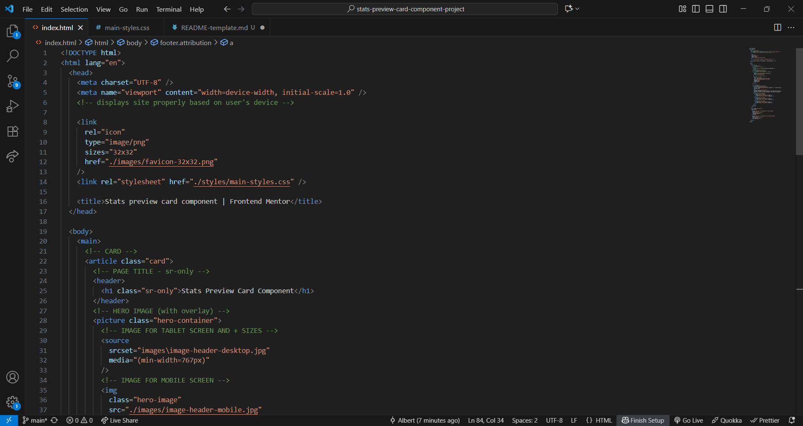
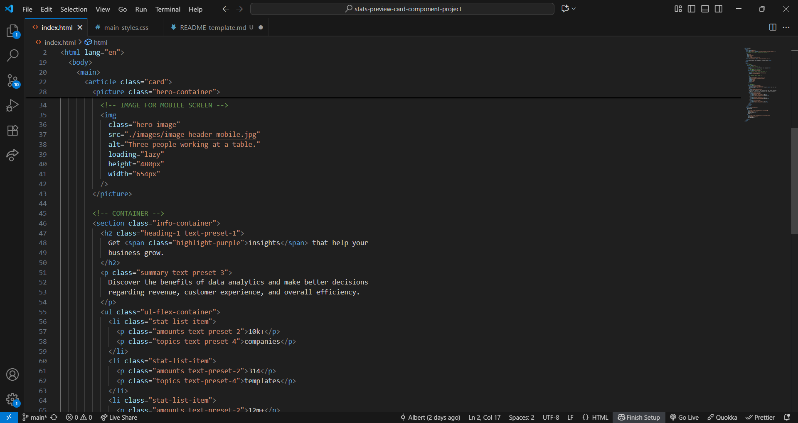
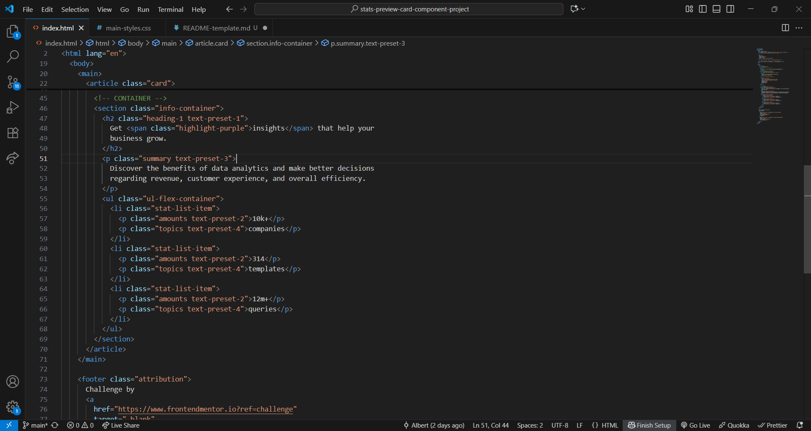
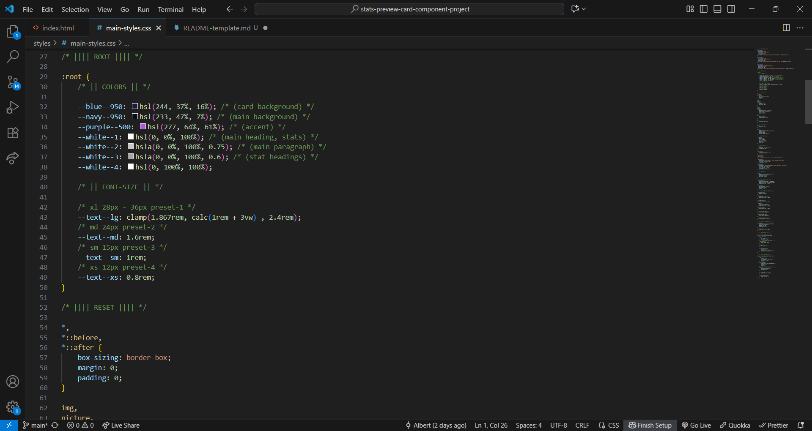
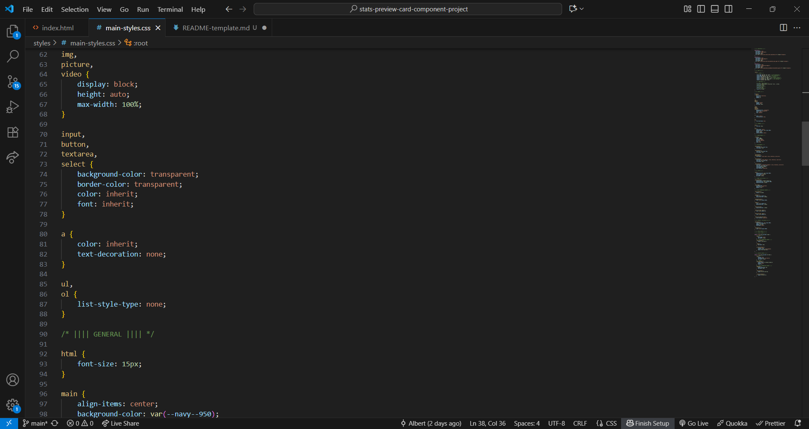
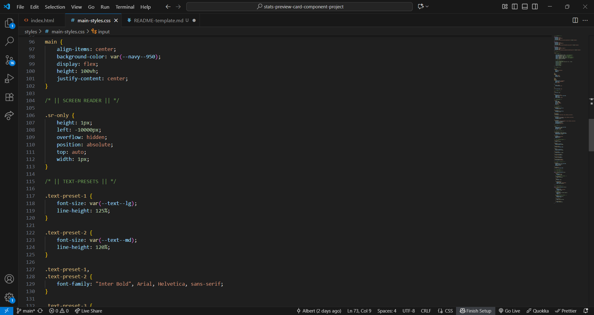
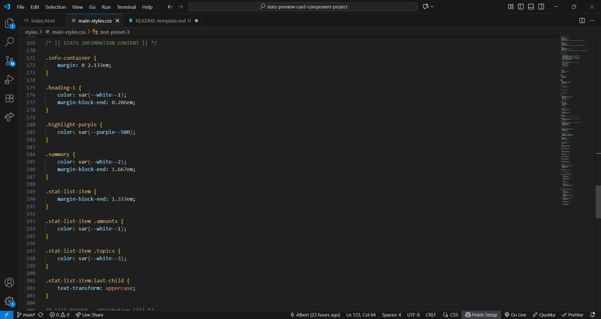
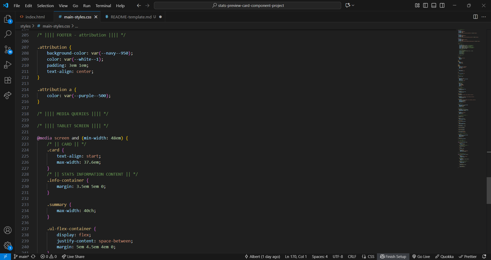

# Frontend Mentor - Stats preview card component solution

This is a solution to the [Stats preview card component challenge on Frontend Mentor](https://www.frontendmentor.io/challenges/stats-preview-card-component-8JqbgoU62). Frontend Mentor challenges help you improve your coding skills by building realistic projects.

## Table of contents

- [Overview](#overview)
  - [The challenge](#the-challenge)
  - [Screenshot](#screenshot)
  - [Links](#links)
- [My process](#my-process)
  - [Built with](#built-with)
  - [What I learned](#what-i-learned)
  - [Continued development](#continued-development)
  - [Useful resources](#useful-resources)
- [Author](#author)
- [Acknowledgments](#acknowledgments)

## Overview

### The challenge

Estimated Time: 10hrs

Completion Time: 6:54

Users should be able to:

- View the optimal layout depending on their device's screen size

### Screenshot

#### HTML






#### CSS










### Links

- Solution URL: [Github @BertSki90](https://github.com/BertSki90/stats-preview-card-component)
- Live Site URL: [Github Pages @BertSki90](https://github.com/BertSki90/stats-preview-card-component)

## My process

### Built with

- Semantic HTML5 markup
- CSS custom properties
- Flexbox
- Mobile-first workflow

### What I learned

I am practicing creating overlays. I learnt about the "mix-blend-mode: multiply;" property and value, and used it for the first time. This property and value gave the image more definition, which is what the design called for. I find setting the size of the overlay the most tricky part. In this project I set the overlay without specifically giving the ".hero-container" or the ".hero-image" a width and a height, this was is very setisfying.

To see code for the overlay created in this project, see below:

```html
<!-- HERO IMAGE (with overlay) -->
<picture class="hero-container">
  <!-- IMAGE FOR TABLET SCREEN AND + SIZES -->
  <source srcset="images\image-header-desktop.jpg" media="(min-width=767px)" />
  <!-- IMAGE FOR MOBILE SCREEN -->
  
</picture>
```

```css
/* || IMAGE (with overlay) || */

.hero-container {
  border-radius: 0.533em 0.533em 0 0;
  background-color: var(--purple--500);
  margin-block-end: 2.133em;
}

.hero-image {
  mix-blend-mode: multiply;
  object-fit: cover;
  opacity: 0.75;
}
```

### Continued development

I will continue to develope my HTML and CSS skills. Specifically HTML semantic meaning, and working with images and creating overlays.

### Useful resources

N/A

## Author

- Website - [Github @BertSki90](https://github.com/BertSki90)
- Frontend Mentor - [@BertSki90](hhttps://www.frontendmentor.io/profile/BertSki90)
- X - [@BertSki90](https://x.com/BertSki90)

## Acknowledgments

I want to thank Frontend Mentor and FreeCodeCamp for giving me the oppertunity to learn how to code and growing my coding ambitions. Thank you to the coding community for all you help!
